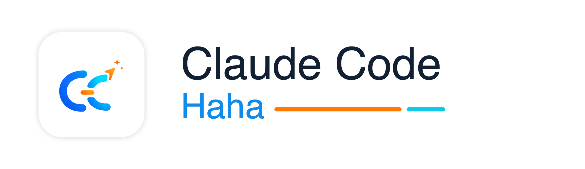

# Claude Code Haha

<p align="center">
  
</p>

<div align="center">

[](https://github.com/NanmiCoder/cc-haha/stargazers)
[](https://github.com/NanmiCoder/cc-haha/network/members)
[](https://github.com/NanmiCoder/cc-haha/issues)
[](https://github.com/NanmiCoder/cc-haha/pulls)
[](https://github.com/NanmiCoder/cc-haha/blob/main/LICENSE)
[](README.md)
[](README.en.md)
[](https://claudecode-haha.relakkesyang.org)

</div>

A Claude Code build repaired from the source leaked from Anthropic's npm registry on 2026-03-31. Claude Code Haha is now primarily a **desktop Claude Code workspace** for macOS, Windows, and Linux: sessions, projects, branch / Worktree launch, right-side file changes, code diffs, permission review, provider setup, Computer Use, H5 remote access, IM integration, and scheduled tasks in one app.

<p align="center">
  <a href="#desktop-preview">Desktop Preview</a> · <a href="#install-the-desktop-app">Install</a> · <a href="#desktop-highlights">Highlights</a> · <a href="#sponsorship--partnership">Sponsorship</a> · <a href="#more-documentation">More Docs</a>
</p>

---

## Desktop Preview

The Claude Code Haha desktop app brings sessions, multi-project navigation, branch / Worktree controls, right-side file changes, code diffs, permission review, provider setup, and remote access into one graphical workspace for daily development flows beyond the terminal.

<p align="center">
  <a href="https://github.com/NanmiCoder/cc-haha/releases"></a>
  &nbsp;
  <a href="docs/desktop/04-installation.md"></a>
</p>

<table>
  <tr>
    <td align="center" width="25%"><br><b>Desktop Workspace</b></td>
    <td align="center" width="25%"><br><b>Right-side Changes & Worktree</b></td>
    <td align="center" width="25%"><br><b>Code Editing & Diff View</b></td>
    <td align="center" width="25%"><br><b>Permission Review & AI Questions</b></td>
  </tr>
  <tr>
    <td align="center" width="25%"><br><b>H5 Remote Access</b></td>
    <td align="center" width="25%"><br><b>Token Usage</b></td>
    <td align="center" width="25%"><br><b>Computer Use</b></td>
    <td align="center" width="25%"><br><b>Scheduled Tasks</b></td>
  </tr>
</table>

---

## Install the Desktop App

1. Download the macOS / Windows / Linux desktop installer from [Releases](https://github.com/NanmiCoder/cc-haha/releases).
2. On first launch, configure your model provider, API key, and default model in Settings.
3. Public macOS releases require signing and notarization. Draft or unsigned temporary builds may still need one-time manual approval. Unsigned Windows installers may show SmartScreen; click "More info" -> "Run anyway". See the [desktop installation guide](docs/desktop/04-installation.md).

## Run the CLI from Source

For users who want to debug the underlying CLI, server, or local development flow:

```bash
bun install
cp .env.example .env
./bin/claude-haha
```

See [environment variables](docs/en/guide/env-vars.md) and [global usage](docs/en/guide/global-usage.md) for more configuration options.

---

## Desktop Highlights

- **Multi-session workspace**: tabs, project switching, terminal entry, and session history in one place.
- **Branch / Worktree launch**: choose a repository branch and decide whether to use the current working tree or an isolated Worktree.
- **Right-side file changes**: review changed files, added/removed lines, and current workspace state while chatting.
- **Visual code changes**: inspect edits, file writes, and diffs directly in the desktop app.
- **Permission review**: approve risky commands, tool calls, and model follow-up questions in the GUI.
- **Multi-provider setup**: configure Anthropic-compatible APIs, third-party models, WebSearch fallback, and local options.
- **Skill Marketplace**: discover, preview, install, and manage third-party skills from ClawHub / SkillHub in the desktop app.
- **Session Activity Panel**: review tasks, background tasks, SubAgents, team activity, and sources in one side panel.
- **Computer Use**: let the agent take screenshots, click, type, and control desktop apps after authorization.
- **H5 remote access**: open the current desktop session from a phone or another device with a one-time token.
- **IM integration**: chat, switch projects, and approve actions through Telegram / Feishu / WeChat / DingTalk.
- **Scheduled tasks and usage stats**: create planned tasks and track local token usage trends.

---

## More Documentation

| Document | Description |
|------|------|
| [Environment Variables](docs/en/guide/env-vars.md) | Full env var reference and configuration methods |
| [Third-Party Models](docs/en/guide/third-party-models.md) | Using OpenAI / DeepSeek / Ollama and other non-Anthropic models |
| [Contributing](docs/en/guide/contributing.md) | Local tests, live model baselines, PR gates, and release gates |
| [Memory System](docs/memory/01-usage-guide.md) | Cross-session persistent memory usage and implementation |
| [Multi-Agent System](docs/agent/01-usage-guide.md) | Agent orchestration, parallel tasks and Teams collaboration |
| [Skills System](docs/skills/01-usage-guide.md) | Extensible capability plugins, custom workflows and conditional activation |
| [IM Integration](docs/im/) | Remote chat, project switching, and permission approval via Telegram / Feishu / WeChat / DingTalk |
| [Computer Use](docs/en/features/computer-use.md) | Desktop control (screenshots, mouse, keyboard) — [Architecture](docs/en/features/computer-use-architecture.md) |
| [Desktop App](docs/desktop/) | Electron + React GUI client — [Quick Start](docs/desktop/01-quick-start.md) \| [Architecture](docs/desktop/02-architecture.md) \| [Installation](docs/desktop/04-installation.md) |
| [Global Usage](docs/en/guide/global-usage.md) | Run claude-haha from any directory |
| [FAQ](docs/en/guide/faq.md) | Common error troubleshooting |
| [Source Fixes](docs/en/reference/fixes.md) | Fixes compared with the original leaked source |
| [Project Structure](docs/en/reference/project-structure.md) | Code directory structure |

---

## Sponsorship & Partnership

This project is maintained in the author's spare time. Corporate or individual sponsorships are welcome to support ongoing development. Custom features, integrations, and business partnerships are also open for discussion.

<table>
  <thead>
    <tr>
      <th width="220">Sponsor</th>
      <th align="left">Description</th>
    </tr>
  </thead>
  <tbody>
    <tr>
      <td align="center" valign="middle">
        <a href="https://jiekou.ai/referral?invited_code=OBNU3K">
          <br>
          <strong>接口AI</strong>
        </a>
      </td>
      <td valign="middle">
        Thanks to <a href="https://jiekou.ai/referral?invited_code=OBNU3K">JieKou AI</a> for sponsoring this project. JieKou AI provides official model resources with stable, high-performance API access. Subscription bundles are priced at 20% off the official rate; new users who register through <a href="https://jiekou.ai/referral?invited_code=OBNU3K">this link</a> and bind GitHub can claim a $3 coupon.
      </td>
    </tr>
    <tr>
      <td align="center" valign="middle">
        <a href="https://www.shengsuanyun.com/?from=CH_LEJ88KWR">
          
        </a>
      </td>
      <td valign="middle">
        Thanks to <a href="https://www.shengsuanyun.com/?from=CH_LEJ88KWR">ShengSuanYun</a> for sponsoring this project. ShengSuanYun is an industrial-grade AI task parallel execution platform for AI Native Teams, aggregating Claude, ChatGPT, Gemini, and other LLM, image, and video model capacity through direct, non-reverse-engineered access. Its platform SLA reaches 99.7%, with <a href="https://watch.shengsuanyun.com/status/shengsuanyun">service status</a> available online. It also supports dedicated enterprise gateways, cost and permission controls, smart routing, security protection, BYOK, usage-based billing, upcoming tokens plans, and invoicing. New users registering through <a href="https://www.shengsuanyun.com/?from=CH_LEJ88KWR">this link</a> can receive 10 yuan in model credits plus a 10% first top-up bonus.
      </td>
    </tr>
    <tr>
      <td align="center" valign="middle">
        <a href="https://teamorouter.com/?utm_source=cc_haha&utm_medium=referral&utm_campaign=ai_directory">
          
        </a>
      </td>
      <td valign="middle">
        Thanks to <a href="https://teamorouter.com/?utm_source=cc_haha&utm_medium=referral&utm_campaign=ai_directory">TeamoRouter</a> for sponsoring this project. TeamoRouter is an enterprise-grade Agentic LLM gateway for developers, AI teams, and businesses. Without any subscription, it lets you use Claude Code, Codex, Gemini CLI, and other popular AI agents through a single unified API, with API pricing at discounts of up to 90%. It aggregates hundreds of official model providers and trusted infrastructure partners — including OpenAI, Anthropic, Vertex, Azure, and AWS Bedrock — each verified for 100% Agent protocol compatibility, cache performance, and request traceability, delivering near-official TTFT, a 99.6% SLA, throughput up to 5,000 QPM, and industry-leading cache hit rates rather than reverse-engineered endpoints. It also offers centralized billing, team management, BYOK, smart routing, usage analytics, and dedicated support, and Teamo Desktop lets you use these AI agents with one-click setup. New users who register through <a href="https://teamorouter.com/?utm_source=cc_haha&utm_medium=referral&utm_campaign=ai_directory">this link</a> receive 10% off their first top-up.
      </td>
    </tr>
  </tbody>
</table>

📧 **Contact**: relakkes@gmail.com

---

## ☕ Buy Me a Coffee

If this project helps you, consider buying me a coffee — every bit of support keeps this project going ❤️

<table>
<tr>
<td align="center" width="33%">
<br>
<b>WeChat Pay</b>
</td>
<td align="center" width="33%">
<br>
<b>Alipay</b>
</td>
<td align="center" width="33%">
<a href="https://buymeacoffee.com/relakkes" target="_blank">

</a><br>
<b>Buy Me a Coffee</b>
</td>
</tr>
</table>

---

## Tech Stack

| Category | Technology |
|------|------|
| Language | TypeScript |
| Desktop app | Electron |
| Desktop UI | React + Vite |
| Local runtime | [Bun](https://bun.sh) |
| Terminal UI | React + [Ink](https://github.com/vadimdemedes/ink) |
| CLI parsing | Commander.js |
| API | Anthropic SDK |
| Protocols | MCP, LSP |

## Thanks

Thanks to the following open-source projects and community practices for reference and inspiration:

- [React](https://github.com/facebook/react): frontend engineering and component-based UI ecosystem.
- [Electron](https://github.com/electron/electron): cross-platform desktop app capabilities and engineering practices.
- [cc-switch](https://github.com/farion1231/cc-switch): reference for model provider configuration.

---

## ⭐ Star History

If this project helps you, please support it with a ⭐ Star so more people can discover Claude Code Haha.

<a href="https://www.star-history.com/#NanmiCoder/cc-haha&Date">
  <picture>
    <source media="(prefers-color-scheme: dark)" srcset="https://api.star-history.com/svg?repos=NanmiCoder/cc-haha&type=Date&theme=dark" />
    <source media="(prefers-color-scheme: light)" srcset="https://api.star-history.com/svg?repos=NanmiCoder/cc-haha&type=Date" />
    
  </picture>
</a>

---

## Disclaimer

This repository is based on the Claude Code source leaked from the Anthropic npm registry on 2026-03-31. All original source code copyrights belong to [Anthropic](https://www.anthropic.com). It is provided for learning and research purposes only.
