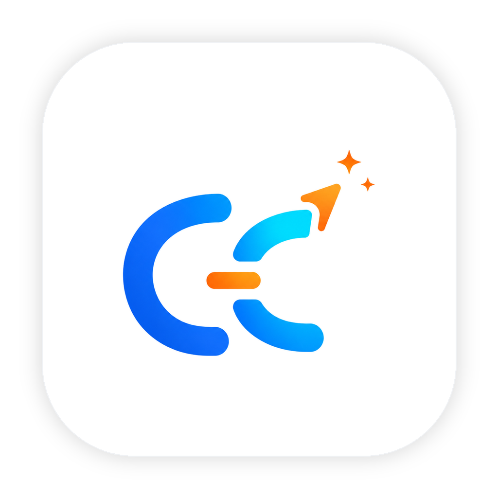
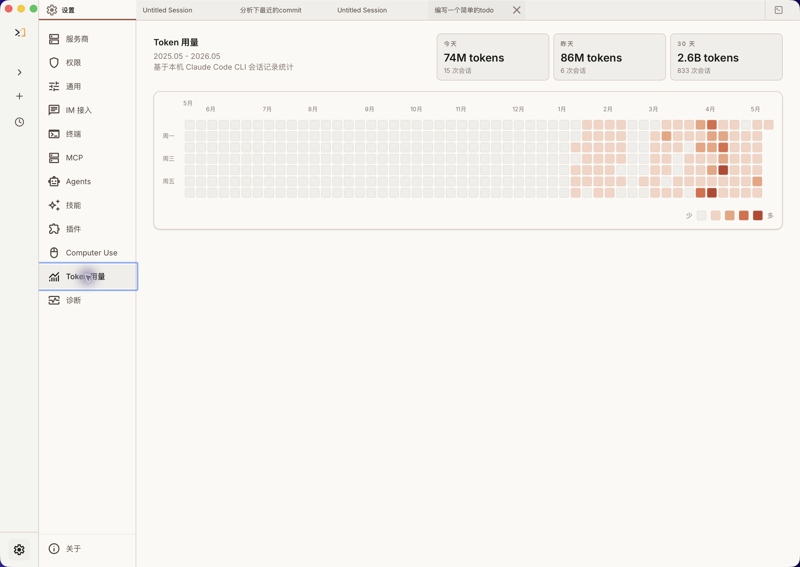

# Claude Code Haha

<p align="center">
  
</p>

<div align="center">

[](https://github.com/NanmiCoder/cc-haha/stargazers)
[](https://github.com/NanmiCoder/cc-haha/network/members)
[](https://github.com/NanmiCoder/cc-haha/issues)
[](https://github.com/NanmiCoder/cc-haha/pulls)
[](https://github.com/NanmiCoder/cc-haha/blob/main/LICENSE)
[](README.md)
[](README.en.md)
[](https://claudecode-haha.relakkesyang.org)

</div>

Claude Code Haha 基于 2026-03-31 从 Anthropic npm registry 泄露的 Claude Code 源码修复而来，现在主要是一个**桌面端 Claude Code 工作台**：把会话、多项目、分支 / Worktree、右侧代码改动、代码 Diff、权限审批、模型提供商、Computer Use、H5 远程访问、IM 接入和定时任务集中到一个 macOS / Windows / Linux APP 里。

<p align="center">
  <a href="#桌面端预览">桌面端预览</a> · <a href="#安装桌面端">安装桌面端</a> · <a href="#桌面端亮点">桌面端亮点</a> · <a href="#赞助与合作">赞助与合作</a> · <a href="#更多文档">更多文档</a>
</p>

---

## 桌面端预览

Claude Code Haha 的桌面端把会话、多项目、分支 / Worktree、右侧代码改动、代码 Diff、权限确认、提供商配置和远程入口集中到一个图形化工作台里，适合不想长期停留在终端里的日常开发工作流。

<p align="center">
  <a href="https://github.com/NanmiCoder/cc-haha/releases"></a>
  &nbsp;
  <a href="docs/desktop/04-installation.md"></a>
</p>

<table>
  <tr>
    <td align="center" width="25%"><br><b>桌面端工作台</b></td>
    <td align="center" width="25%"><br><b>右侧代码改动 & Worktree</b></td>
    <td align="center" width="25%"><br><b>代码编辑 & Diff 视图</b></td>
    <td align="center" width="25%"><br><b>权限控制 & AI 提问</b></td>
  </tr>
  <tr>
    <td align="center" width="25%"><br><b>H5 远程访问</b></td>
    <td align="center" width="25%"><br><b>Token 用量统计</b></td>
    <td align="center" width="25%"><br><b>Computer Use</b></td>
    <td align="center" width="25%"><br><b>定时任务</b></td>
  </tr>
</table>

---

## 安装桌面端

1. 前往 [Releases](https://github.com/NanmiCoder/cc-haha/releases) 下载 macOS / Windows / Linux 桌面端安装包。
2. 首次启动后，在桌面端设置里配置模型提供商、API Key 和默认模型。
3. 正式 macOS Release 需要经过签名和公证；如果安装的是 draft/unsigned 临时包，首次打开可能仍需手动放行。Windows 未签名安装包可能出现 SmartScreen 提示，点「更多信息」→「仍要运行」即可。详见 [桌面端安装指南](docs/desktop/04-installation.md)。

## 从源码启动 CLI

适合想调试底层 CLI、服务端或自行开发的用户：

```bash
bun install
cp .env.example .env
./bin/claude-haha
```

更多配置见 [环境变量](docs/guide/env-vars.md) 和 [全局使用](docs/guide/global-usage.md)。

---

## 桌面端亮点

- **多会话工作台**：标签页、项目切换、终端入口和会话历史集中管理。
- **分支 / Worktree 启动**：新会话可以选择仓库分支，并决定使用当前工作树还是隔离 Worktree。
- **右侧代码改动面板**：聊天时直接在右侧查看已更改文件、增删行和当前工作区状态。
- **代码修改可视化**：直接查看 AI 对文件的编辑、Diff 和执行过程。
- **权限与确认流**：危险命令、工具调用和 AI 反问可以在桌面端集中审批。
- **多模型提供商**：支持 Anthropic 兼容 API、第三方模型、WebSearch fallback 和本地配置。
- **技能市场**：在桌面端发现、预览、安装和管理 ClawHub / SkillHub 第三方技能。
- **会话活动面板**：集中查看任务、后台任务、SubAgent、团队活动和 sources。
- **Computer Use**：让 Agent 在授权后截图、点击、输入并控制桌面应用。
- **H5 远程访问**：用一次性令牌在手机或其他设备上接入当前桌面端会话。
- **IM 接入**：通过 Telegram / 飞书 / 微信 / 钉钉远程对话、切换项目和审批权限。
- **定时任务与用量统计**：在桌面端创建计划任务，并查看本机 Token 使用趋势。

---

## 更多文档

| 文档 | 说明 |
|------|------|
| [环境变量](docs/guide/env-vars.md) | 完整环境变量参考和配置方式 |
| [第三方模型](docs/guide/third-party-models.md) | 接入 OpenAI / DeepSeek / Ollama 等非 Anthropic 模型 |
| [贡献与质量门禁](docs/guide/contributing.md) | 本地测试、真实模型 baseline、PR 和 release 门禁 |
| [记忆系统](docs/memory/01-usage-guide.md) | 跨会话持久化记忆的使用与实现 |
| [多 Agent 系统](docs/agent/01-usage-guide.md) | 多代理编排、并行任务执行与 Teams 协作 |
| [Skills 系统](docs/skills/01-usage-guide.md) | 可扩展能力插件、自定义工作流与条件激活 |
| [IM 接入](docs/im/) | 通过 Telegram / 飞书 / 微信 / 钉钉远程对话、切换项目和审批权限 |
| [Computer Use](docs/features/computer-use.md) | 桌面控制功能（截屏、鼠标、键盘）— [架构解析](docs/features/computer-use-architecture.md) |
| [桌面端](docs/desktop/) | Electron + React 图形化客户端 — [快速上手](docs/desktop/01-quick-start.md) \| [架构设计](docs/desktop/02-architecture.md) \| [安装指南](docs/desktop/04-installation.md) |
| [全局使用](docs/guide/global-usage.md) | 在任意目录启动 claude-haha |
| [常见问题](docs/guide/faq.md) | 常见错误排查 |
| [源码修复记录](docs/reference/fixes.md) | 相对于原始泄露源码的修复内容 |
| [项目结构](docs/reference/project-structure.md) | 代码目录结构说明 |

---

## 赞助与合作

本项目由个人利用业余时间维护，欢迎企业或个人赞助支持持续开发，也可洽谈定制、集成或商务合作。

<table>
  <thead>
    <tr>
      <th width="220">赞助商</th>
      <th align="left">介绍</th>
    </tr>
  </thead>
  <tbody>
    <tr>
      <td align="center" valign="middle">
        <a href="https://jiekou.ai/referral?invited_code=OBNU3K">
          <br>
          <strong>接口AI</strong>
        </a>
      </td>
      <td valign="middle">
        感谢 <a href="https://jiekou.ai/referral?invited_code=OBNU3K">接口AI</a> 赞助本项目！接口AI 提供官方资源直供与稳定高性能 API 体验，订阅包价格为官方 8 折；使用 <a href="https://jiekou.ai/referral?invited_code=OBNU3K">专属链接</a> 注册并绑定 GitHub，可领取 3 美元优惠券。
      </td>
    </tr>
    <tr>
      <td align="center" valign="middle">
        <a href="https://www.shengsuanyun.com/?from=CH_LEJ88KWR">
          
        </a>
      </td>
      <td valign="middle">
        感谢 <a href="https://www.shengsuanyun.com/?from=CH_LEJ88KWR">胜算云</a> 赞助本项目！胜算云是面向 AI Native Teams 的工业级 AI 任务并行执行平台，聚合 Claude、ChatGPT、Gemini 等海内外 LLM 及图片、视频多媒体模型算力；官方直连、非逆向，平台 SLA 可用性达 99.7%，可查看 <a href="https://watch.shengsuanyun.com/status/shengsuanyun">服务状态</a>。平台支持企业专属网关、成本与权限管控、智能路由、安全防护和 BYOK，按量与 tokens plan（即将上线）计费并可开票；使用 <a href="https://www.shengsuanyun.com/?from=CH_LEJ88KWR">专属链接</a> 注册可获 10 元模力及首充 10% 赠送。
      </td>
    </tr>
    <tr>
      <td align="center" valign="middle">
        <a href="https://teamorouter.com/?utm_source=cc_haha&utm_medium=referral&utm_campaign=ai_directory">
          
        </a>
      </td>
      <td valign="middle">
        感谢 <a href="https://teamorouter.com/?utm_source=cc_haha&utm_medium=referral&utm_campaign=ai_directory">TeamoRouter</a> 赞助本项目！TeamoRouter 是面向开发者、AI 团队与企业的企业级 Agentic LLM 网关，无需任何订阅即可通过统一 API 使用 Claude Code、Codex、Gemini CLI 等热门 AI Agent，API 价格最高可享 90% 折扣。平台聚合 OpenAI、Anthropic、Vertex、Azure、AWS Bedrock 等数百家官方模型提供商与可信基础设施，全部经过 100% Agent 协议兼容、缓存性能与请求可追踪性验证，官方直连、非逆向，提供接近官方的 TTFT、99.6% SLA、最高 5,000 QPM 吞吐与行业领先的缓存命中率；同时支持集中账单、团队管理、BYOK、智能路由、用量分析与专属支持，并可通过 Teamo Desktop 一键使用各类 AI Agent。新用户通过 <a href="https://teamorouter.com/?utm_source=cc_haha&utm_medium=referral&utm_campaign=ai_directory">专属链接</a> 注册，首次充值可享 10% 折扣。
      </td>
    </tr>
  </tbody>
</table>

📧 **联系邮箱**：relakkes@gmail.com

---

## ☕ 请作者喝杯咖啡

如果这个项目对您有帮助，欢迎打赏支持，您的每一份支持都是我持续更新的动力 ❤️

<table>
<tr>
<td align="center" width="33%">
<br>
<b>微信赞赏</b>
</td>
<td align="center" width="33%">
<br>
<b>支付宝</b>
</td>
<td align="center" width="33%">
<a href="https://buymeacoffee.com/relakkes" target="_blank">

</a><br>
<b>Buy Me a Coffee</b>
</td>
</tr>
</table>

---

## 技术栈

| 类别 | 技术 |
|------|------|
| 语言 | TypeScript |
| 桌面 APP | Electron |
| 桌面 UI | React + Vite |
| 本地运行时 | [Bun](https://bun.sh) |
| 终端 UI | React + [Ink](https://github.com/vadimdemedes/ink) |
| CLI 解析 | Commander.js |
| API | Anthropic SDK |
| 协议 | MCP, LSP |

## 感谢

感谢以下开源项目和社区实践为本项目提供参考与启发：

- [React](https://github.com/facebook/react)：前端工程与组件化 UI 生态。
- [Electron](https://github.com/electron/electron)：跨端桌面应用能力与工程实践。
- [cc-switch](https://github.com/farion1231/cc-switch)：模型供应商配置能力参考。


---

## Disclaimer

本仓库基于 2026-03-31 从 Anthropic npm registry 泄露的 Claude Code 源码。所有原始源码版权归 [Anthropic](https://www.anthropic.com) 所有。仅供学习和研究用途。
