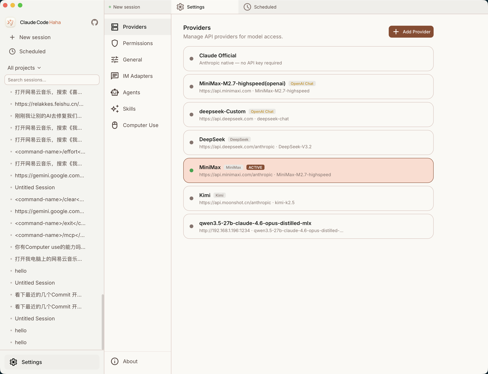
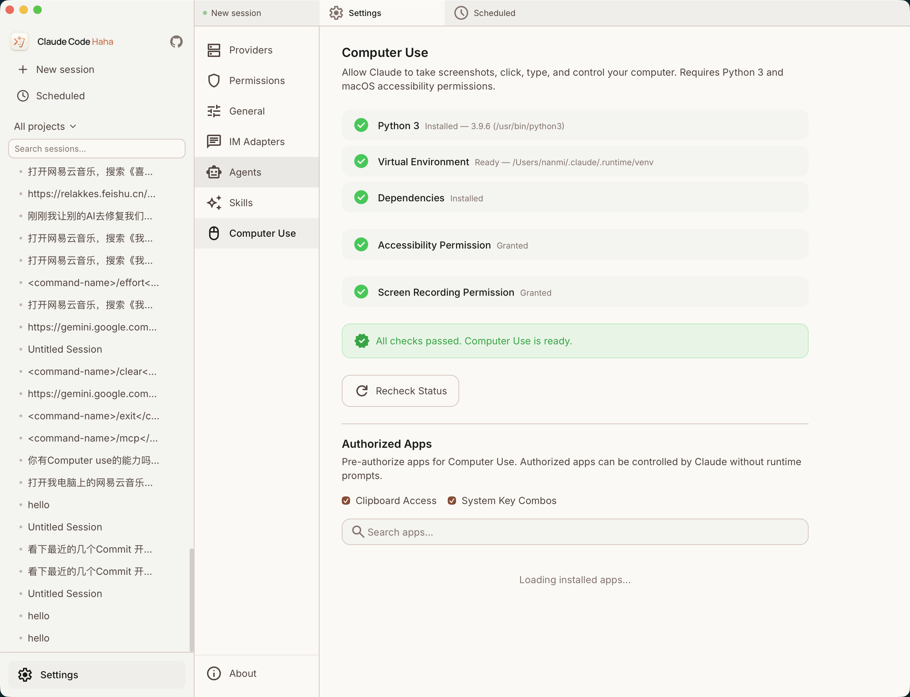

# 功能详解

> 桌面端核心功能模块一览。

---

## 聊天引擎

聊天引擎是桌面端核心，负责消息收发、流式渲染和工具交互。

### 消息类型

| 类型 | 组件 | 说明 |
|------|------|------|
| 用户消息 | `UserMessage` | 文本 + 附件画廊 |
| 助手消息 | `AssistantMessage` | Markdown 渲染 + 流式光标 `▍` |
| 思考块 | `ThinkingBlock` | Extended Thinking，默认折叠 |
| 工具调用 | `ToolCallBlock` / `ToolCallGroup` | 按工具类型专门展示 |
| 工具结果 | `ToolResultBlock` | 成功/失败状态 + 输出内容 |
| 权限请求 | `PermissionDialog` | 操作预览 + 允许/一直允许/拒绝 |
| AI 提问 | `AskUserQuestion` | AI 向用户提问的专用输入框 |
| 任务摘要 | `InlineTaskSummary` | 后台任务进度内联展示 |

### 工具展示

不同工具有专门的渲染方式：

- **Bash** — `TerminalChrome` 终端风格，深色背景 + `$` 提示符
- **Edit / Write** — `DiffViewer` 展示文件变更，词级别高亮
- **Read** — `CodeViewer` 语法高亮
- **Glob / Grep** — 搜索模式 + 匹配结果
- **其他** — JSON 格式展示输入参数

### 输入系统

`ChatInput` 组合组件：

- 自适应高度文本框（最高 200px）
- 附件画廊（粘贴图片 / 拖拽上传 / 文件选择）
- 项目上下文芯片（Git 仓库 + 分支）
- `/` 斜杠命令菜单（服务端动态提供，支持搜索）
- `@` 文件搜索菜单（路径自动补全）
- 图片画廊（`ImageGalleryModal` / `InlineImageGallery`）

### 流式输出

- Shiki 实时语法高亮
- 闪烁光标动画
- `StreamingIndicator` 状态指示
- 随时可停止（`Cmd/Ctrl + .`）

---

## 代码展示

### CodeViewer

基于 Shiki（VS Code 同款引擎），支持行号、超 20 行自动折叠、一键复制。

### DiffViewer

基于 react-diff-viewer-continued，单列模式，词级别变更高亮，自动识别文件语言。

### MarkdownRenderer

基于 marked + DOMPurify，代码块自动 Shiki 高亮，支持表格、列表、引用、链接。

### MermaidRenderer

支持流程图、时序图、甘特图等，`securityLevel: 'strict'`，渲染失败回退显示源码。

---

## 多标签系统

- `Cmd/Ctrl + N` 新建标签
- 拖拽排序、右键菜单（关闭当前/其他/左侧/右侧/全部）
- 标签状态：绿色脉冲 = 运行中，红色 = 出错
- 关闭运行中标签需确认
- 标签状态 localStorage 持久化，重启恢复

---

## 权限控制

### 四种模式

| 模式 | 说明 |
|------|------|
| 询问权限 (default) | 每个操作需确认 |
| 自动接受 (acceptEdits) | 自动允许编辑 |
| 计划模式 (plan) | 只展示计划不执行 |
| 绕过权限 (bypassPermissions) | 全部自动（需二次确认） |

### 权限请求对话框

显示工具类型、操作预览（Diff/命令内容）、可展开详情。三个按钮：允许 / 一直允许 / 拒绝。

---

## Agent Teams

当 AI 创建 Agent Team 时，桌面端可视化展示协作状态。

- **团队视图** (`AgentTeams` 页面) — 团队列表 + 成员状态（running/idle/completed/error）
- **成员转录** — 点击成员查看完整对话记录（1.5s 轮询更新）
- **TeamStatusBar** — 活跃会话底部展示团队名称和成员状态

---

## 提供商管理

在设置 → Providers 标签页管理 AI 提供商。

### 预设

点击「添加提供商」从预设快速创建：Anthropic、OpenAI、OpenRouter、Ollama、Azure OpenAI、Google AI 等。预设自动填充 Base URL 和 API 格式。

### 配置项

| 字段 | 说明 |
|------|------|
| API Key | 密钥（密码输入） |
| Base URL | API 地址 |
| API 格式 | `anthropic` / `openai_chat` / `openai_responses` |
| 模型映射 | main / haiku / sonnet / opus 对应的实际模型名 |

### 连接测试

两步验证：连接性 + 模型可用性，结果以 Toast 通知展示。

---

## 技能与 Agent

### 技能浏览

设置 → Skills 标签页：

- 按来源分类（bundled / user / project / plugin）
- 搜索过滤
- 详情视图：元数据 + 源代码目录树 + 代码内容

### Agent 定义

设置 → Agents 标签页：

管理 Agent 类型定义（agentType、description、model、tools、systemPrompt、color），支持 built-in / plugin / userSettings / projectSettings / localSettings 多种来源。

---

## 定时任务

侧边栏时钟图标进入，顶部统计卡片（总计/活跃/禁用）。

### 创建任务

| 字段 | 说明 |
|------|------|
| 任务名称 | 描述性名称 |
| 提示词 | `PromptEditor` 多行编辑 |
| Cron 表达式 | 标准语法 + `cronDescribe` 人类可读描述 |
| 星期几 | `DayOfWeekPicker` 可视化多选 |
| 模型 | 选择 AI 模型 |
| 权限模式 | 执行时的权限策略 |

### 任务管理

启用/禁用开关、运行历史（可展开）、手动运行、删除。

---

## IM 适配器

设置 → Adapters 标签页，配置 Telegram / 飞书接入。

### 配置

**Telegram**: Bot Token + 允许的用户 ID

**飞书**: App ID + App Secret + 加密密钥 + 验证 Token + 允许的用户 open_id + 流式卡片开关

### 用户配对

6 位安全码（排除易混淆字符），60 分钟有效，一次性使用。同一用户 5 分钟内最多失败 5 次。

### IM 操作

| 命令 | 效果 |
|------|------|
| 直接发文本 | 与 Claude Code 对话 |
| `/new [项目]` 或 `新会话` | 开始新会话 |
| `/projects` 或 `项目列表` | 查看最近项目 |
| `/stop` 或 `停止` | 停止生成 |

权限请求在 IM 中以按钮形式展示（Telegram Inline Keyboard / 飞书 Interactive Card）。

---

## Computer Use

设置 → Computer Use 标签页，查看和配置 Computer Use 功能状态。

`ComputerUseSettings` 页面展示：平台信息、Python 环境、venv 状态、依赖安装情况、权限配置。

---

## 工具检查

`ToolInspection` 页面，查看当前会话中可用的工具列表和详情。

---

## 设计系统

### 颜色

暖色调设计语言：

- **品牌色**: `#8F482F`（褐红色）
- **浅色背景**: `#FAF9F5`（奶油色）
- **信息色**: `#2D628F` / **成功色**: `#4F6237` / **错误色**: `#BA1A1A`

### 主题

浅色/深色切换，设置 → 通用中配置。

### 动画

| 名称 | 用途 |
|------|------|
| `shimmer` | 流式输出闪烁光标 |
| `pulse-dot` | 运行中会话指示 |
| `spin` | 加载旋转 |
| `progress-fill` | 进度条填充 |

### Toast 通知

右下角固定通知，四种类型（success/error/warning/info），自动消失 + 手动关闭。

### 自动更新

`UpdateChecker` 组件：启动后检查 GitHub Releases，有新版本时弹出更新提示，支持自动下载安装重启。

---

## 国际化

支持中文 (`zh`) 和英文 (`en`)，设置 → 通用中切换，`localStorage` 持久化。

Key 命名空间：`common.*`、`sidebar.*`、`chat.*`、`settings.*`、`status.*`、`titlebar.*` 等。

---

## 键盘快捷键

| 快捷键 | 功能 |
|--------|------|
| `Cmd/Ctrl + N` | 新建会话 |
| `Cmd/Ctrl + K` | 聚焦搜索 |
| `Cmd/Ctrl + .` | 停止生成 |
| `Escape` | 关闭模态框 |
| `Enter` | 发送消息 |
| `Shift + Enter` | 换行 |
| `/` | 斜杠命令 |
| `@` | 文件搜索 |
