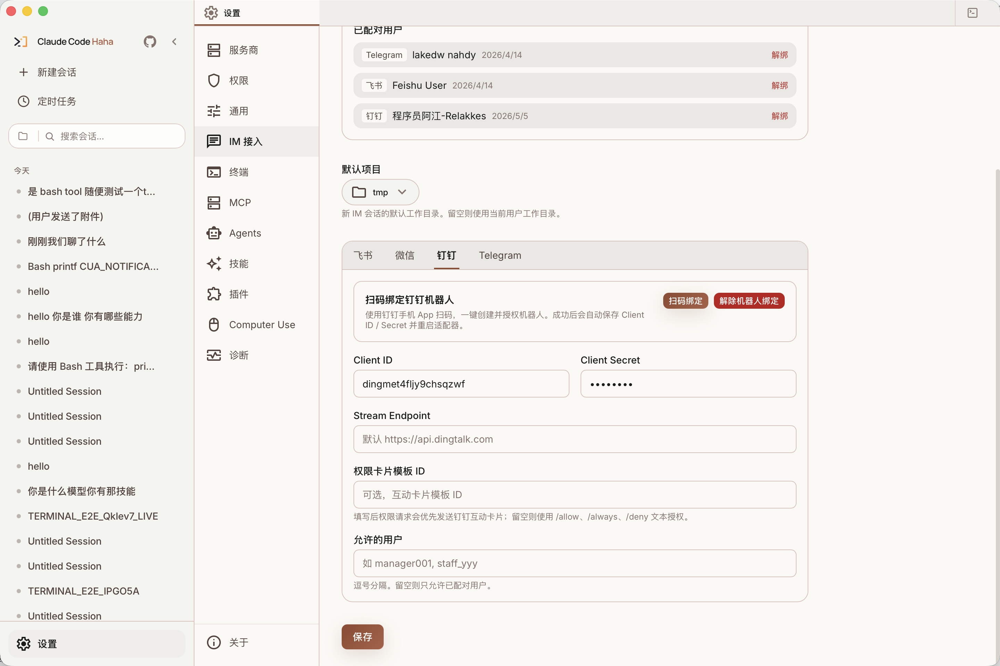
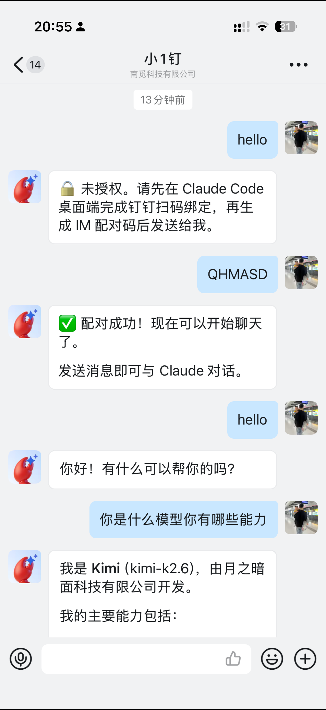

# 钉钉接入

> 钉钉 Adapter 的接入教程。钉钉走 DingTalk Stream，不需要公网回调地址。

## 适用场景

钉钉方案适合通过钉钉单聊远程驱动本机 Claude Code。当前实现只处理单聊消息，不处理群聊。

当前实现支持文本聊天、图片附件、项目选择、状态查看、停止生成、AI Card 流式输出，以及文本或卡片形式的权限审批。

实现入口：`adapters/dingtalk/index.ts`

## 1. 绑定钉钉机器人

打开桌面端 `设置 -> IM 接入 -> 钉钉`。

推荐使用扫码绑定：

1. 点击「扫码绑定」。
2. 使用钉钉手机 App 扫码。
3. 在钉钉里确认创建并授权机器人。
4. 等待桌面端显示「钉钉机器人已绑定」。
5. 点击保存，或确认当前配置已经写入本地。

授权成功后，桌面端会把 `clientId` 和 `clientSecret` 写入 `~/.claude/adapters.json` 的 `dingtalk` 配置。发布版桌面端会重启 adapter sidecar，让新凭据立即生效。



## 2. 手动填写凭据

如果扫码不可用，也可以手动填写：

- `Client ID` — 钉钉应用的 `appKey`
- `Client Secret` — 钉钉应用的 `appSecret`
- `Stream Endpoint` — 可选，默认 `https://api.dingtalk.com`
- `权限卡片模板 ID` — 可选，配置后权限请求优先使用钉钉互动卡片
- `Allowed Users` — 可选，直接放行指定钉钉用户 ID

保存后 adapter 会用 DingTalk Stream 建立长连接。

## 3. 授权具体钉钉用户

机器人绑定完成后，还需要让具体用户通过配对码授权：

1. 在 `设置 -> IM 接入` 顶部的「配对管理」里点击「生成配对码」。
2. 在钉钉机器人单聊里发送这枚 6 位配对码。
3. 看到配对成功提示后，就可以开始聊天。



配对码有效期 60 分钟，一次性使用。配对用户会出现在「已配对用户」列表里，可以随时解绑。解绑后该用户需要重新发送新的配对码才能使用。

## 4. 选择项目并开始对话

如果已经配置默认项目，发送任意消息会直接在该目录下创建或复用 Claude Code session。

如果没有配置默认项目，adapter 会返回最近项目列表。回复编号、项目名或绝对路径后，会新建会话并绑定到当前钉钉 chat。

后续消息会复用 `~/.claude/adapter-sessions.json` 里的 chat 到 session 映射。发送 `/new` 可以重新选择项目并开启新会话。

## 支持的命令

钉钉这里没有像飞书那样的机器人菜单配置流程；当前命令入口就是单聊输入框。配对成功后，bot 会提示发送 `/help`；用户也可以随时发送 `/help` 或 `帮助` 查看完整命令列表。

- `/help` 或 `帮助` — 显示可用命令
- `/status` 或 `状态` — 查看当前会话的项目、分支、模型、运行状态和任务摘要
- `/projects` 或 `项目列表` — 重新显示最近项目列表
- `/new` 或 `新会话` — 清空当前 chat 绑定的 session，并重新选择项目
- `/new <编号、项目名或绝对路径>` — 直接在指定项目下新建会话
- `/clear` 或 `清空` — 清空当前会话上下文，保留项目绑定
- `/stop` 或 `停止` — 向当前 session 发送 `stop_generation`

## 权限审批

默认情况下，钉钉 adapter 会发送文本审批消息。回复：

- `/allow <requestId>` — 允许一次权限请求
- `/always <requestId>` — 永久允许同类权限请求
- `/deny <requestId>` — 拒绝一次权限请求

如果配置了已发布的钉钉互动卡片模板 ID，adapter 会优先发送权限卡片，并通过 DingTalk Stream 的 `/v1.0/card/instances/callback` 接收按钮回调。卡片发送失败或不可见时，仍可使用文本命令审批。

## 返回消息的表现

- 使用 `dingtalk-stream` 接收机器人单聊消息。
- 使用消息里的 `sessionWebhook` 回复 Markdown 文本。
- 普通回复优先使用 AI Card 做流式输出。
- 权限审批可以使用互动卡片；没有模板时自动回退文本命令。
- 图片附件会下载后以内联图片形式进入模型输入。
- 附件会走公共大小限制检查，超限时 adapter 会在钉钉里返回提示。

## 解绑

有两种解绑：

- 解绑钉钉机器人账号：在钉钉标签页点击「解绑机器人账号」，会清空 `dingtalk.clientId`、`dingtalk.clientSecret`、`allowedUsers`、`pairedUsers` 和权限卡片模板 ID。
- 解绑某个用户：在「已配对用户」列表里点击对应钉钉用户右侧的「解绑」，只移除该用户的 `pairedUsers` 记录。

解绑机器人账号后需要重新扫码或手动填写凭据。解绑用户后，该用户需要重新发送新的配对码才能继续使用。

## 本地开发启动

发布版桌面端会自动启动 adapter sidecar。只有本地开发或单独调试时才需要手动运行：

```bash
cd adapters
bun install
bun run dingtalk
```

可选环境变量：

```bash
export DINGTALK_CLIENT_ID="..."
export DINGTALK_CLIENT_SECRET="..."
export DINGTALK_STREAM_ENDPOINT="https://api.dingtalk.com"
export DINGTALK_PERMISSION_CARD_TEMPLATE_ID="..."
export ADAPTER_SERVER_URL="ws://127.0.0.1:3456"
```

正常桌面端使用不需要手动设置这些环境变量，扫码绑定或手动填写会写入本地配置。

## 常见问题

### 扫码成功后发消息仍提示未授权

这是正常授权流程的一部分。扫码绑定只写入机器人凭据；具体钉钉用户还需要发送配对码，或被加入 `Allowed Users`。

### 扫码失败或一直等待确认

重新点击「扫码绑定」生成新二维码。如果仍失败，可以手动填写 `Client ID` 和 `Client Secret`。

### adapter 启动时报缺少 clientId / clientSecret

说明 `DINGTALK_CLIENT_ID / DINGTALK_CLIENT_SECRET` 和 `~/.claude/adapters.json` 里的 `dingtalk.clientId / dingtalk.clientSecret` 都没有生效。先在桌面端钉钉标签页完成扫码绑定或手动填写凭据。

### 权限卡片没有出现

优先检查：

- 是否已经配置发布后的权限卡片模板 ID。
- 模板是否支持 adapter 使用的回调路由。
- 当前机器人是否已经发布新版本。

即使卡片不可见，也可以用 `/allow <requestId>`、`/always <requestId>`、`/deny <requestId>` 完成审批。

### 收不到回复

优先检查：

- 桌面端是否正在运行。
- 钉钉标签页是否显示已绑定。
- 当前用户是否已经配对或在 `Allowed Users` 中。
- `~/.claude/adapters.json` 是否能正常写入。
- 本地开发时 `ADAPTER_SERVER_URL` 是否指向正在运行的 Desktop server WebSocket 地址。

### 会话没恢复

检查 `~/.claude/adapter-sessions.json` 是否能正常写入，以及 Desktop server 里的 session 是否仍存在。

## 源码入口

- `adapters/dingtalk/index.ts`
- `adapters/dingtalk/helpers.ts`
- `adapters/dingtalk/ai-card.ts`
- `adapters/dingtalk/permission-card.ts`
- `adapters/dingtalk/media.ts`
- `adapters/common/pairing.ts`
- `adapters/common/session-store.ts`
- `adapters/common/ws-bridge.ts`
- `adapters/common/http-client.ts`
