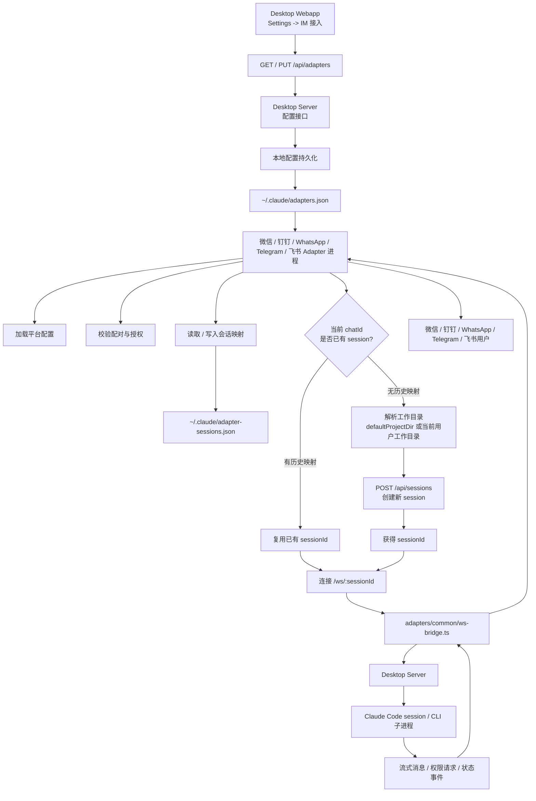

# IM 接入

> 当前可用的 IM 接入方案总览。  
> 如果你只是想把微信、钉钉、WhatsApp、Telegram 或飞书接进来，从这篇开始。

## 当前方案是什么

当前仓库里的 IM 接入，已经不是早期文档里设想的 “IM Gateway / MCP Channel 插件” 主路径。

现在真实在跑的是一条更轻的链路：



可以把这条链路理解成四层：

- 配置层：桌面端 webapp 负责填写平台凭据、默认项目和配对码管理
- 存储层：本地服务端把配置写入 `~/.claude/adapters.json`
- 适配层：微信 / 钉钉 / WhatsApp / Telegram / 飞书 adapter 进程负责接 IM 平台、做授权检查、恢复或创建会话
- 会话层：adapter 通过 HTTP 创建 session，再通过 WebSocket 把 IM 消息桥接到 Claude Code 会话

## 用户怎么用

### 1. 在 Desktop Webapp 里配置

打开桌面端设置页的 `IM 接入` 标签，填写：

- `serverUrl`
- `defaultProjectDir`
- 微信 / 钉钉 / WhatsApp 扫码绑定，或填写 Telegram / 飞书各自的凭据
- 可选 `allowedUsers`

这里的配置会通过 `GET /api/adapters` 和 `PUT /api/adapters` 读写到 `~/.claude/adapters.json`。

### 2. 生成配对码

配对也在同一个设置页完成：

- 点击“生成配对码”
- 前端生成 6 位码并写入 `pairing.code / expiresAt / createdAt`
- 码有效期 60 分钟
- 配对成功后立即失效

配对码是平台无关的，同一个码可以在微信、钉钉、WhatsApp、Telegram 或飞书私聊里使用一次。

微信、钉钉和 WhatsApp 的“扫码绑定”只负责把机器人或账号凭据写到本机；具体 IM 用户仍然需要发送配对码，或被加入 `allowedUsers`。

### 3. 启动对应 Adapter 进程

发布版桌面端会在本地 server 启动后自动拉起 adapter sidecar，并在保存凭据、扫码绑定或解绑后重启 adapter 让新配置生效。本地开发或单独调试 adapter 时可以手动启动：

```bash
cd adapters
bun install
bun run telegram
# 或
bun run feishu
# 或
bun run wechat
# 或
bun run dingtalk
# 或
bun run whatsapp
```

### 4. 在 IM 里私聊 Bot

- 未配对用户：先把配对码发给 bot
- 已配对用户：直接发送自然语言消息
- 没有默认项目时：bot 会使用当前用户工作目录作为新会话目录
- 后续消息会复用同一个 Claude session

## 配置和状态分别存哪

### `~/.claude/adapters.json`

保存平台配置和授权状态，包括：

- `serverUrl`
- `defaultProjectDir`
- `pairing`
- `telegram`
- `feishu`
- `wechat`
- `dingtalk`
- `whatsapp`

其中：

- 敏感字段会在 API 返回时被脱敏
- 配对码也会被 `/api/adapters` 返回值掩码为 `******`

### `~/.claude/adapter-sessions.json`

保存 IM chat 到 Claude session 的映射：

- `chatId`
- `sessionId`
- `workDir`
- `updatedAt`

这让 bot 重启后仍然能接回原来的会话。

## 当前安全模型

授权规则是：

- `allowedUsers` 和 `pairedUsers` 取并集
- 两者都为空时，默认拒绝访问
- 配对码为 6 位安全字符集
- 配对码一次性使用
- 同一用户 5 分钟内最多失败 5 次

这和旧 README 里“`allowedUsers` 为空就允许所有人”的说法已经不同，旧说法已过时。

## 会话行为

Adapter 不是直接把消息丢给一个全局 Claude 进程，而是：

1. 先用 `POST /api/sessions` 创建 session
2. 再用 `ws://.../ws/:sessionId` 建立桥接
3. 把 IM 消息转成：
   - `user_message`
   - `permission_response`
   - `stop_generation`
4. 把服务端流式消息再格式化回 IM

如果没有 `defaultProjectDir`，Adapter 会优先使用当前用户工作目录作为新 session 的工作目录，避免扫码绑定后还必须先在桌面端打开项目。

## 平台差异

- Telegram：`grammy`，按钮审批，纯私聊模式
- 飞书：`@larksuiteoapi/node-sdk`，长连接事件订阅，交互卡片审批，当前只处理 `p2p`
- 微信：扫码绑定账号，`getupdates` 长轮询接收消息，文本命令审批使用 `/allow <requestId>` / `/deny <requestId>`
- 钉钉：扫码给本机写入 Stream 凭据，`dingtalk-stream` 长连接收发消息，配对码绑定用户后开始聊天
- WhatsApp：`@whiskeysockets/baileys` 连接 WhatsApp Web，扫码写入本机 auth state，当前只处理个人私聊，文本命令审批

分别看：

- [微信接入](./wechat.md)
- [钉钉接入](./dingtalk.md)
- [WhatsApp 接入](./whatsapp.md)
- [Telegram 接入](./telegram.md)
- [飞书接入](./feishu.md)

## 和 `docs/channel/` 的关系

`docs/channel/` 主要是 Claude Code 原生 Channel/MCP 体系的源码研究资料，不是这个仓库当前推荐的 IM 接入方式。

如果你是要“把 bot 真跑起来”，看本目录。  
如果你是要研究 Claude Code 原始 Channel 设计，再去看 `docs/channel/`。
