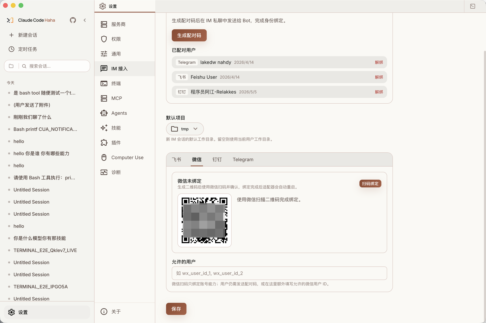
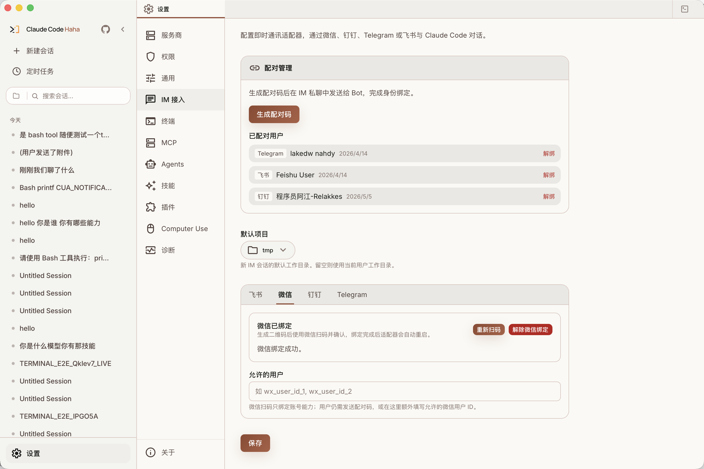
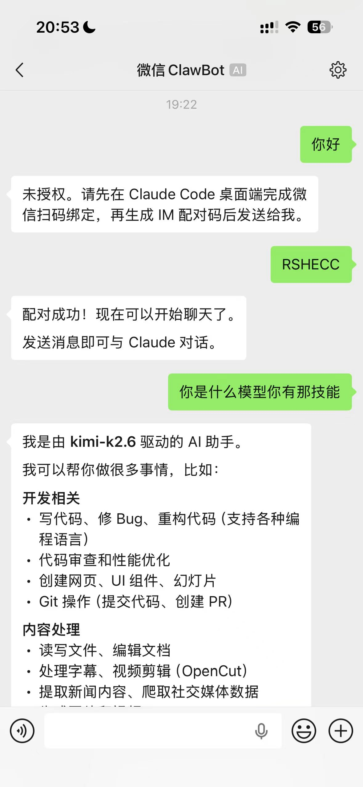

# 微信接入

> 微信 Adapter 的接入教程。桌面端扫码绑定机器人账号后，再用配对码授权具体微信用户。

## 适用场景

微信方案适合个人私聊远程使用。当前实现支持文本聊天、语音转文字内容、图片和文件附件、项目选择、状态查看、停止生成和权限审批。

当前只按私聊用户维度授权和保存会话，不面向微信群聊设计。

实现入口：`adapters/wechat/index.ts`

## 1. 扫码绑定微信机器人账号

打开桌面端 `设置 -> IM 接入 -> 微信`。

在微信标签页里：

1. 点击「扫码绑定」。
2. 使用微信扫描页面里的二维码。
3. 在微信里确认登录。
4. 等待页面显示绑定成功。
5. 点击保存，或确认当前配置已经写入本地。



扫码成功后，桌面端会把微信网关返回的 `accountId`、`botToken`、`baseUrl` 和 `userId` 写入 `~/.claude/adapters.json` 的 `wechat` 配置。发布版桌面端会重启 adapter sidecar，让新凭据立即生效。

绑定成功后，微信标签页会显示「微信已绑定」，并提供「重新扫码」和「解除微信绑定」：



注意：扫码绑定的是机器人账号凭据，不等于把所有微信用户都授权了。用户访问仍然走 `allowedUsers + pairedUsers` 授权模型。

## 2. 授权具体微信用户

推荐走配对码：

1. 在 `设置 -> IM 接入` 顶部的「配对管理」里点击「生成配对码」。
2. 把 6 位配对码发给微信里的机器人。
3. 看到配对成功提示后，就可以直接发送自然语言消息。



配对码有效期 60 分钟，一次性使用。重新生成配对码后，旧码会失效。

也可以把已知微信用户 ID 手动写进微信标签页的 `Allowed Users`。这种方式适合固定账号白名单，但一般没有配对码直观。

## 3. 选择项目并开始对话

如果已经配置默认项目，发送任意消息会直接在该目录下创建或复用 Claude Code session。

如果没有配置默认项目，微信 adapter 会返回最近项目列表。回复编号、项目名或绝对路径后，会新建会话并绑定到当前微信用户。

后续消息会复用 `~/.claude/adapter-sessions.json` 里的 chat 到 session 映射。发送 `/new` 可以重新选择项目并开启新会话。

## 支持的命令

微信没有可配置菜单，命令入口就是聊天框。配对成功后，bot 会提示发送 `/help`；后续随时发 `/help` 或 `帮助` 都能看到当前支持的命令。

- `/help` 或 `帮助` — 显示可用命令
- `/status` 或 `状态` — 查看当前会话的项目、分支、模型、运行状态和任务摘要
- `/projects` 或 `项目列表` — 重新显示最近项目列表
- `/new` 或 `新会话` — 清空当前 chat 绑定的 session，并重新选择项目
- `/new <编号、项目名或绝对路径>` — 直接在指定项目下新建会话
- `/clear` 或 `清空` — 清空当前会话上下文，保留项目绑定
- `/stop` 或 `停止` — 向当前 session 发送 `stop_generation`

## 权限审批

当 Claude 请求敏感权限时，微信 adapter 会发送一条文本审批消息，里面包含 request id。

在微信里回复：

- `/allow <requestId>` — 允许一次权限请求
- `/always <requestId>` — 永久允许同类权限请求
- `/deny <requestId>` — 拒绝一次权限请求

审批结果会通过 WebSocket 桥接回桌面端 session。

## 返回消息的表现

- 使用 `getupdates` 长轮询接收微信消息。
- 文本回复按 3500 字左右分片发送。
- thinking 和工具执行期间会尽量发送微信 typing 状态。
- 图片会以内联图片形式进入模型输入；非图片文件会以本地临时文件路径传给会话。
- 附件会走公共大小限制检查，超限时 adapter 会在微信里返回提示。

## 解绑

有两种解绑：

- 解绑微信机器人账号：在微信标签页点击「解绑微信账号」，会清空 `wechat.accountId`、`wechat.botToken`、`wechat.userId`、`allowedUsers` 和 `pairedUsers`。
- 解绑某个用户：在「已配对用户」列表里点击对应微信用户右侧的「解绑」，只移除该用户的 `pairedUsers` 记录。

解绑机器人账号后需要重新扫码绑定。解绑用户后，该用户需要重新发送新的配对码才能继续使用。

## 本地开发启动

发布版桌面端会自动启动 adapter sidecar。只有本地开发或单独调试时才需要手动运行：

```bash
cd adapters
bun install
bun run wechat
```

可选环境变量：

```bash
export WECHAT_ACCOUNT_ID="..."
export WECHAT_BOT_TOKEN="..."
export WECHAT_BASE_URL="https://ilinkai.weixin.qq.com"
export WECHAT_USER_ID="..."
export ADAPTER_SERVER_URL="ws://127.0.0.1:3456"
```

正常桌面端使用不需要手动设置这些环境变量，扫码绑定会写入本地配置。

## 常见问题

### 扫码成功后发消息仍提示未授权

这是正常授权流程的一部分。扫码绑定只写入机器人账号凭据；具体微信用户还需要发送配对码，或被加入 `Allowed Users`。

### 页面显示二维码过期

重新点击「扫码绑定」生成新二维码。微信二维码登录状态只在短时间内有效。

### adapter 启动时报缺少微信账号

说明 `WECHAT_ACCOUNT_ID / WECHAT_BOT_TOKEN` 和 `~/.claude/adapters.json` 里的 `wechat.accountId / wechat.botToken` 都没有生效。先在桌面端微信标签页完成扫码绑定。

### 收不到回复

优先检查：

- 桌面端是否正在运行。
- 微信标签页是否显示已绑定。
- 当前用户是否已经配对或在 `Allowed Users` 中。
- `~/.claude/adapters.json` 是否能正常写入。
- 本地开发时 `ADAPTER_SERVER_URL` 是否指向正在运行的 Desktop server WebSocket 地址。

### 会话没恢复

检查 `~/.claude/adapter-sessions.json` 是否能正常写入，以及 Desktop server 里的 session 是否仍存在。

## 源码入口

- `adapters/wechat/index.ts`
- `adapters/wechat/protocol.ts`
- `adapters/wechat/media.ts`
- `adapters/common/pairing.ts`
- `adapters/common/session-store.ts`
- `adapters/common/ws-bridge.ts`
- `adapters/common/http-client.ts`
